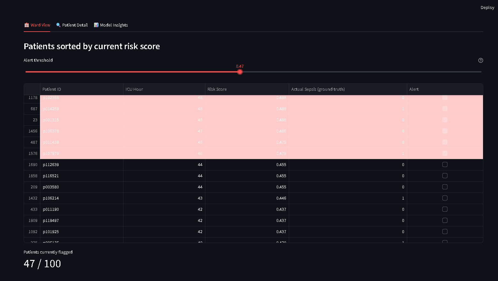
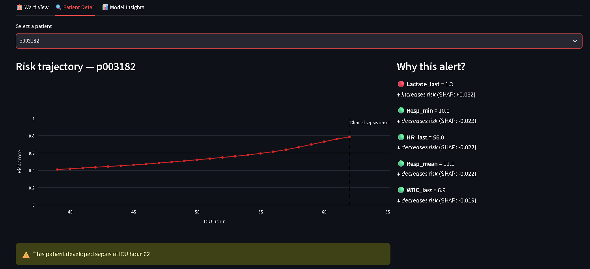
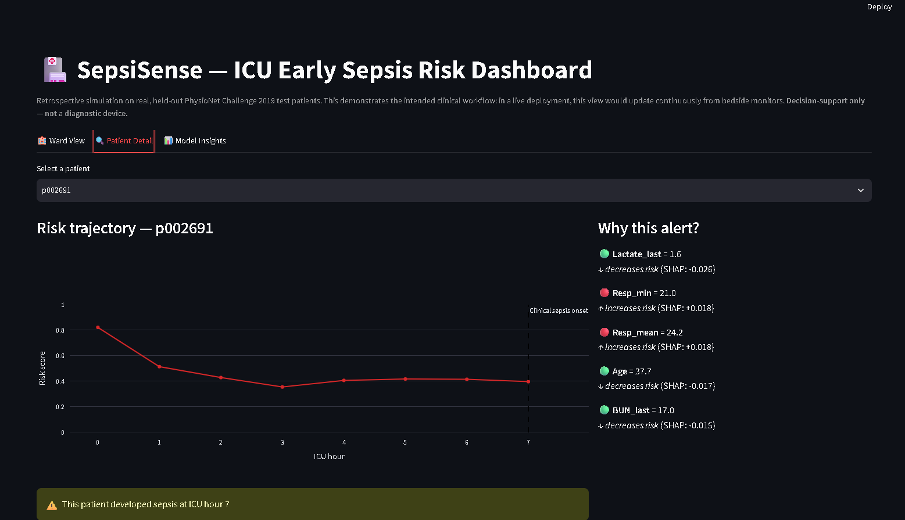
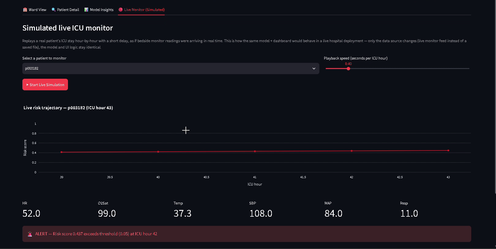
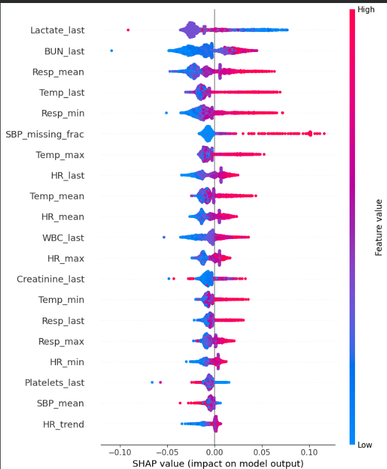
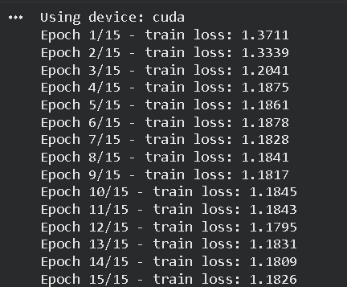

# 🏥 SepsiSense — Explainable AI for Early Sepsis Prediction in ICU Patients

> A machine learning system that predicts sepsis onset in ICU patients hours before clinical diagnosis — built on real, de-identified patient data, benchmarked against the clinical standard (SOFA/qSOFA), and made explainable with SHAP.


---

## The Problem

Sepsis is one of the leading causes of in-hospital mortality worldwide. Every hour of delayed treatment measurably increases mortality risk, yet current clinical practice relies on **SOFA/qSOFA** — reactive, threshold-based scores that only flag deterioration *after* it's already progressed.

**SepsiSense** asks: can a model learn the pattern of deterioration *before* a human-designed threshold would catch it — and can it do so without drowning clinicians in false alarms?

## The Result

We built and evaluated three systems on the **same real, held-out test population** of ICU patients:

| Model | AUROC | AUPRC | Precision | Recall | Avg. Lead-Time |
|---|---|---|---|---|---|
| SOFA / qSOFA (rule-based, clinical standard) | N/A | N/A | 0.21% | 56.5% | 60.0 hrs |
| Gradient Boosted Trees | 0.72 | 0.006 | 1.23% | 13.8% | 49.4 hrs |
| **LSTM (sequence model)** | **0.73** | **0.008** | **1.25%** | **23.6%** | **59.4 hrs** |

**The headline finding:** our LSTM predicts sepsis almost as early as the clinical standard (**59.4 vs. 60.0 hours** ahead of onset) while being **~6x more precise** (1.25% vs. 0.21%). In plain terms — the rule-based score fires one true alert for every ~480 false alarms; our model fires one true alert for every ~80. Same early-warning value, dramatically less alert fatigue.

---

## 📊 Screenshots

### Ward View — triage patients by real-time risk


### Patient Detail — risk trajectory + SHAP explanation
A real sepsis-positive patient: risk rises steadily from 0.42 to 0.78 as they approach actual clinical onset.


**Honesty check:** not every case is textbook. Here's a real patient where risk *decreases* despite eventually developing sepsis — included because a good project reports its failure modes, not just its wins.


### Simulated Real-Time Monitor
Replays a real patient's ICU stay hour-by-hour with a short delay — vitals, risk score, and SHAP explanation update live, simulating what a real bedside-monitor integration would look like.


### Explainability — SHAP Global Feature Importance
Each dot is one patient-hour; color = feature value (red=high, blue=low); position = whether it pushed risk up or down. Lactate, BUN, and respiratory rate dominate — consistent with real sepsis physiology, not noise.


### LSTM Training Curve


---

## 🧠 How It Works

```
Raw ICU vitals/labs (hourly)
        │
        ▼
Preprocessing: forward-fill, rolling-window features,
recency-aware lab features, patient-level train/val/test split
        │
        ├──────────────┬───────────────────┐
        ▼              ▼                   ▼
  SOFA/qSOFA        Gradient Boosted     LSTM
  (rule-based        Trees               (sequence model,
   baseline)         (tabular ML)         PyTorch)
        │              │                   │
        └──────────────┴───────────────────┘
                        ▼
          Evaluation: AUROC, AUPRC, Precision,
             Recall, Lead-Time vs. clinical onset
                        │
                        ▼
        SHAP explainability + Streamlit dashboard
        (Ward View, Patient Detail, Live Monitor)
```

## 📁 Dataset

[PhysioNet/Computing in Cardiology Challenge 2019](https://physionet.org/content/challenge-2019/1.0.0/) — real, de-identified ICU time-series data from ~40,336 patients across two hospital systems. Freely available, no individual credentialing required (unlike raw MIMIC-III). Sepsis labels are pre-computed per the Sepsis-3 clinical criteria, with a built-in 6-hour early-warning offset.

**Note:** Raw patient data is **not included in this repository** (see below) — download it yourself from the link above.

---

## 🛠️ Tech Stack

| Layer | Tools |
|---|---|
| Data processing | Python, Pandas, NumPy |
| Baseline | Custom rule-based Modified SOFA/qSOFA scorer |
| ML models | scikit-learn (Random Forest/GBT), PyTorch (LSTM) |
| Explainability | SHAP (TreeExplainer) |
| Dashboard | Streamlit, Plotly |
| Training compute | Google Colab (free-tier GPU) |

---

## 🚀 Getting Started

### 1. Clone and install
```bash
git clone https://github.com/<your-username>/sepsisense.git
cd sepsisense
pip install -r requirements.txt
```

### 2. Get the data
This repo does not include raw patient data. Download it yourself:
```bash
aws s3 sync --no-sign-request s3://physionet-open/challenge-2019/1.0.0/training ./data/raw/training/
```
Or manually from [physionet.org/content/challenge-2019](https://physionet.org/content/challenge-2019/1.0.0/).

### 3. Run the pipeline
- **Local preprocessing + baseline:** `python src/data/preprocess.py`, then `python src/baseline/sofa_score.py`
- **Full-scale training (GBT + LSTM + SHAP):** open `notebooks/SepsiSense_Full_Pipeline_Colab.ipynb` in [Google Colab](https://colab.research.google.com) and run top to bottom (GPU runtime recommended)

### 4. Run the dashboard
```bash
cd src/dashboard
pip install streamlit plotly
streamlit run dashboard.py
```
Place `dashboard_export.csv`, `global_feature_importance.csv`, and `final_three_way_comparison.csv` (produced by the notebook) into `src/dashboard/data/` first. See `src/dashboard/DASHBOARD_SETUP.md` for full details.

---

## ⚠️ Limitations (stated honestly)

- **Modified SOFA, not full SOFA** — the dataset lacks GCS (neurological) and PaO2 (respiratory) fields, so our rule-based baseline uses 4 of the standard components. Documented in the full report.
- **Low absolute AUPRC (0.006–0.008)** — expected under ~0.2–0.3% class imbalance; both models still beat a random baseline by 3–4x. Report this in context, not in isolation.
- **Dashboard is a retrospective simulation**, not connected to any live hospital system — this is explicitly out of scope for a student project and stated on the dashboard itself.
- **LSTM training loss plateaus after ~5–6 epochs** — further gains likely need architecture/hyperparameter changes, not just more epochs.

Full discussion in [`report/SepsiSense_Final_Report.docx`](report/SepsiSense_Final_Report.docx).

---

## 📂 Repository Structure

```
sepsisense/
├── README.md
├── requirements.txt
├── .gitignore
├── src/
│   ├── data/             # preprocessing pipeline
│   ├── baseline/         # SOFA/qSOFA rule-based scorer
│   ├── models/           # GBT training script
│   └── dashboard/        # Streamlit app + setup guide
├── notebooks/
│   └── SepsiSense_Full_Pipeline_Colab.ipynb   # full-scale GBT + LSTM + SHAP
├── assets/
│   └── screenshots/      # dashboard screenshots used in this README
└── report/
    └── SepsiSense_Final_Report.docx
```

---

## 👥 Team

- **[Member A Name]** — Data Engineering
- **[Member B Name]** — Modeling
- **[Member C Name]** — Explainability & Frontend

## 📖 Citation

If referencing the dataset: Reyna, M., et al. *"Early Prediction of Sepsis from Clinical Data: the PhysioNet/Computing in Cardiology Challenge 2019."* Critical Care Medicine, 2020.

## ⚖️ Disclaimer

This is an academic research prototype for decision-support demonstration purposes only. It is **not a certified medical device** and must not be used for actual clinical decision-making.
